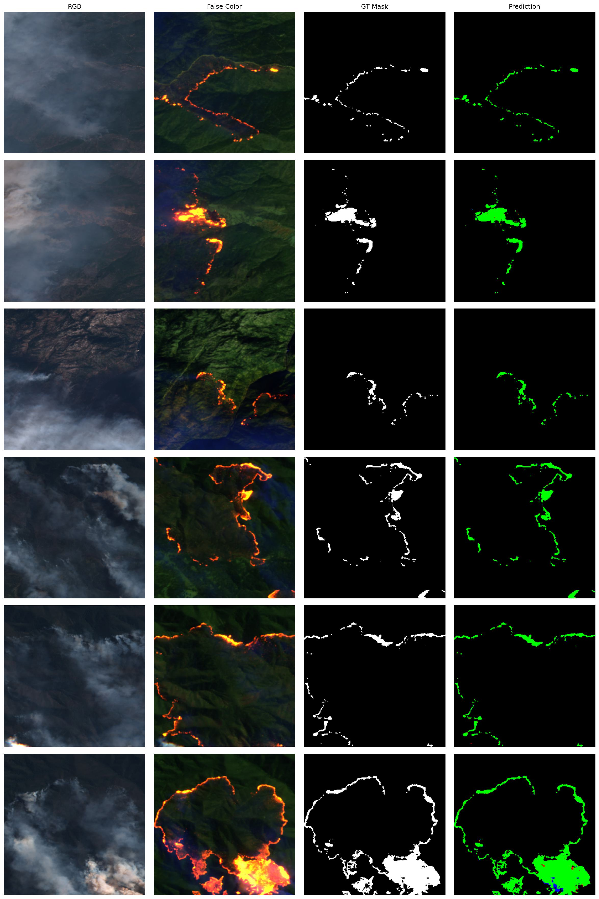

<H1 align="center" style="color:darkviolet"> SENTINEL2 FOREST FIRES DETECTION </H1>

<p align="center">
<br>
</p>

## Demo using a deep learning model to detect forest fires using sentinel-2 multi-spectral satellite imagery


<p align="center">
<br>
</p>


<div id="top"></div>
<!-- TABLE OF CONTENTS -->
<details>
  <summary>Table of Contents</summary>
  <ol>
    <li><a href="#about-this-repository">About This Repository</a></li>
    <li>
      <a href="#getting-Started">Getting Started</a>
    </li>
    <li>
        <a href="#usage">Usage</a>
        <ul>
            <li><a href="#demo_running">Demo running</a></li>
            <li><a href="#data_structure">Data structure</a></li>
        </ul>
    </li>
    <li><a href="#license">License</a></li>
    <li><a href="#contact">Contact</a></li>
    <!-- <li><a href="#references">References</a></li> -->
  </ol>
</details>


<!-- ABOUT THE PROJECT -->

## <div id="about-this-repository">1. About This repository 💼 </div>

This git repository contains a demonstration of active forest fire detection using deep learning. The demo
consists of showing how to load the model and make the inference on some sample images.


### <div id="packages"> This demo is built with </div>

* [Anaconda](https://www.anaconda.com/products/distribution)
* [Python](https://www.python.org/)
* [tensorflow](https://www.tensorflow.org/)
* [skimage](https://scikit-image.org/)
* [matplotlib](https://matplotlib.org/)
* [NumPy](https://numpy.org/)

<p align="right">(<a href="#top">back to top</a>)</p>


<!-- GETTING STARTED -->


## <div id="getting-Started"> 2. Getting Started 📚  </div>

Follow these instructions to locally setup up your project.


- Clone the repo

  ```sh
  git clone "https://github.com/hxfdanger/S2WDSV2.git"
  
  cd S2WDS/
  ```


- Create the dedicated python environment using the S2WDS_env.yml file

   ```sh
   conda env create -f S2WDSV2_env.yml
   ```
🚨 If you have problems while installing the environment, please create it manually, 
then you can manually install the packages mentioned <a href="#packages">here</a>.

- Activate it:
  ```sh
     conda conda activate S2WDSV2
  ```

🚨 to run conda command you have to install [Anaconda distribution](https://www.anaconda.com/products/distribution)). 

<p align="right">(<a href="#top">back to top</a>)</p>


<!-- USAGE EXAMPLES -->

## <div id="usage">3. Usage 📒 </div>

### <div id="demo_running"> Demo running</div>

The jupyter nootebook is not installed in the S2WDS env created by <a href="https://github.com/hxfdanger/S2WDSV2/blob/main/S2WDSV2_env.yml">S2WDS_env.yml </a> file.

🚨 To run the notebook **demo.ipynb** you have to install **jupyter** package in your active (S2WDS) environment
```conda install -c anaconda jupyter```

🏁 Run the notebook [**demo.ipynb**](https://github.com/hxfdanger/S2WDS/blob/prepare_demo/demo.ipynb)

```bash
jupyter notebook demo.ipynb
```

**✍ NOTES:**

- [**Demo.ipynb**](https://github.com/hxfdanger/S2WDS/blob/prepare_demo/demo.ipynb) will use some function declared in
  utils.py
- All images used for the demo are located in data folder. The structure of the data described
  (<a href="#data_structure">bellow</a>).
- The model used in the demo does not exist in this repository. 
you can download all models from [__link__](https://ciar.irt-saintexupery.com/index.php/s/3RLvFSak6Qt7NnB/download?path=%2Fwildifre_data_20m&files=models_20m.zip). 
Do not forget to put it in a folder called models.


### <div id="data_structure">Data structure</div>

```
data/
├── false_color
│         ├── Sentinel-2_L1C_from_2018-08-23_Mendocino_13.tif
│         ├── Sentinel-2_L1C_from_2018-08-23_Mendocino_27.tif
│         ├── Sentinel-2_L1C_from_2018-11-16_Chico_5.tif
│         ├── Sentinel-2_L1C_from_2019-03-04_Traralgon_22.tif
│         ├── Sentinel-2_L1C_from_2019-03-04_Traralgon_71.tif
│         └── Sentinel-2_L1C_from_2019-03-04_Traralgon_76.tif
├── image_distribution
│         └── test.txt
├── masks
│         ├── Sentinel-2_L1C_from_2018-08-23_Mendocino_13.tif
│         ├── Sentinel-2_L1C_from_2018-08-23_Mendocino_27.tif
│         ├── Sentinel-2_L1C_from_2018-11-16_Chico_5.tif
│         ├── Sentinel-2_L1C_from_2019-03-04_Traralgon_22.tif
│         ├── Sentinel-2_L1C_from_2019-03-04_Traralgon_71.tif
│         └── Sentinel-2_L1C_from_2019-03-04_Traralgon_76.tif
└── RGB
    ├── Sentinel-2_L1C_from_2018-08-23_Mendocino_13.tif
    ├── Sentinel-2_L1C_from_2018-08-23_Mendocino_27.tif
    ├── Sentinel-2_L1C_from_2018-11-16_Chico_5.tif
    ├── Sentinel-2_L1C_from_2019-03-04_Traralgon_22.tif
    ├── Sentinel-2_L1C_from_2019-03-04_Traralgon_71.tif
    └── Sentinel-2_L1C_from_2019-03-04_Traralgon_76.tif

```
**✍ NOTES:**

- The data folder only contains examples used to run the demo
- **false_color** folder contains 6 images composed by [B12,B11,B04] (sentinel2 bands) used as the input of the model for inference. 
- **RGB** contains 3 images corrsponding to false_color images composed by [B04,B03,B02] (sentinel2 bands) used only for visualizing.
- **masks** folder contains 6 binary masks (**value : 0=no-fire; value : 1=fire**) corresponding to the images in the false_color folder.
- Image_distribution folder contains 1 files :
  - test.txt : contains the name of 6 images corrsponding to (false_color, RGB and masks) used for the inference

🚨 To download all the data ([__link__](https://ciar.irt-saintexupery.com/index.php/s/3RLvFSak6Qt7NnB?path=%2Fwildifre_data_20m))

👉 For more information about the data please read this ([__Readme__](https://ciar.irt-saintexupery.com/index.php/s/3RLvFSak6Qt7NnB/download?path=%2Fwildifre_data_20m&files=ReadMe_20m.md))

<p align="right">(<a href="#top">back to top</a>)</p>


<!-- LICENSE -->


## <div id="license">4. License 📑</div>


Distributed under the Attribution 4.0 International (CC BY 4.0) License. 

Contains modified Copernicus Sentinel data [2016-2020] for Sentinel data

<p align="right">(<a href="#top">back to top</a>)</p>


<!-- CONTACT -->


## <div id="contact">5. Contact 📭</div>

* [Houssem FARHAT 📧](mailto:houssem.farhat@irt-saintexupery.com)
* [ Benjamin FRANCESCONI 📧](mailto:benjamin.francesconi@irt-saintexupery.com) 
* [Lionel DANIEL 📧](mailto:lionel.daniel@irt-saintexupery.com)
* [Michael BENGUIGUI 📧](mailto:michael.benguigui@irt-saintexupery.com)
* [Adrien GIRARD 📧](mailto:adrien.girard@irt-saintexupery.com)


Project Link: [https://github.com/hxfdanger/S2WDSV2](https://github.com/hxfdanger/S2WDSV2)

<p align="right">(<a href="#top">back to top</a>)</p>


<!-- REFERENCES -->

<!-- ## <div id="references">5. References 📭 </div>


<p align="right">(<a href="#top">back to top</a>)</p> -->

